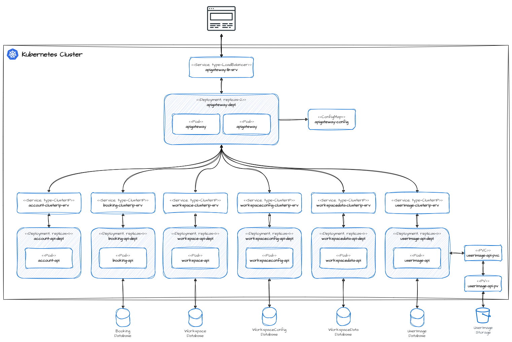

<p id="readme-top" align="center">
  
  <h1  align="center">The Smart Office - Helm Chart</h1>
</p>

## Table of Content

- [Introduction](#introduction)
- [Deployment](#deployment)
  - [Simple Deployment](#simple-deployment)
  - [Deployment with namespace](#deployment-with-dedicated-namespace)

## Introduction

The Smart Office is a microservice application that can be used to manage workstations in a shared workspace environment. In addition to a practical booking system that allows employees to reserve their workstations, Smart Office also offers the option of personalizing the workspace. For example, an employee can store their preferred height of their height-adjustable desk and store their favorite pictures for display in a digital picture frame in the application. Another use case of the Smart Office is the collection of environmental values of the workplaces, such as temperature, CO2 content in the air or humidity. These collected values are then used to create a so-called Workspace Environment Index for each workstation. This index can be used to quickly determine how good or bad a particular workplace is in terms of its environmental values.

## Deployment

The microservices of the Smart Office application are operated in Kubernetes. A Helm Chart with different templates is defined in this repository for the provisioning of the required application components. Each of these templates is responsible for the deployment of a specific microservice. Currently there are two possible options for deploying the microservices in a kubernetes cluster:

- Deployment to an Azure Kubernetes cluster
- Deployment to an on-premises cluster

Depending on the option, there are slight differences in the helmet values provided by two specific value files.

<p align="center">
  
</p>

Before the application can be deployed to a local cluster, it is mandatory to configure the following settings in values.local.yaml:

- **authConfig.authUrl**: The authentication endpoint of the identity provider.
- **mqttConfig.username**: The username to be used to connect to the Mqtt Message Broker.
- **mqttConfig.password**: The password that should be used to connect to the Mqtt Message Broker.
- **userimageApi.storagePath**: The local storage path for storing user images.

[!WARNING] 
User credentials should only be configured directly in the helm chart for a local deployment. For a deployment to Azure, these values should be loaded from an Azure KeyVault via the Azure AppConfig!

### Simple Deployment

To deploy the application in a local cluster the following Helm command must be executed:

```
helm upgrade smartoffice .helm/ --values .helm/values.local.yaml --install --wait
```

To verify the status of provisioned resources in the kubernetes cluster, the CLI kubectl can be executed with the following command:

```
kubectl get all -o wide
```
To remove or uninstall the application from the cluster the following command must be executed:

```
helm upgrade smartoffice . --values .helm/values.local.yaml --install
```

### Deployment with dedicated namespace

If many other applications have already been deployed in the cluster, it is recommended to deploy the Smart Office components in a separate namespace. This makes it easier to manage and monitor the individual resources in the cluster. To do this, you must first modify the ```namespace``` property in file ```values.local.yaml```. The new namespace must then also be specified  when executing the helm command as follows:

```
helm upgrade smartoffice .helm/ --values .helm/values.local.yaml --install --namespace smartoffice --create-namespace --wait
```

The ```--namespace```  switch tells the helm CLI which namespace to use, and the ```--create-namespace```  switch creates it in the cluster if it does not already exist.

To verify the status of provisioned resources in the kubernetes cluster, the kubectl CLI can be executed with the following command:

```
kubectl get all -n smartoffice -o wide
```
This time we use the ```-n``` switch to get only the kubernetes resources for the previously defined namespace.

To remove or uninstall the application from the cluster the following command must be executed:

```
helm uninstall smartoffice --namespace smartoffice --wait
```

To make sure that all resources have been removed from the cluster, the following kubectl command can be executed:

```
kubectl delete namespace smartoffice
```